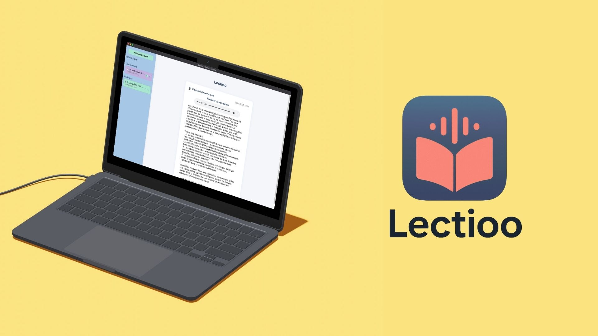

# Lectioo

Z
Lectioo est une application macOS qui transforme tes cours en audio et podcasts de révision grâce à l’IA !

> **Information importante :** Lectioo est un projet en full **vibe coding**, la qualité du code n'est donc pas forcément au rendez-vous.
> 
> L'objectif ici etait uniquement de créer une application fonctionnelle en une après-midi pour l'un de mes fils.



## ✨ Fonctionnalités principales

- **Conversion Texte → Audio** : Collez un texte, obtenez un fichier audio généré par l'IA.
- **Podcast de révisions** : Génération automatique d'un script de podcast (résumé, points clés, quiz) puis conversion en audio.
- **Historique intelligent** : Retrouvez toutes vos conversions et podcasts, avec anti-doublon, date, suppression possible.
- **Interface épurée** : Design moderne, accessible, adapté au contexte scolaire.
- **Gestion de la clé API OpenAI** : Stockée localement, jamais transmise à l'extérieur.

## 📦 Installation

1. **Téléchargez le fichier `.dmg`** depuis la [dernière release GitHub](https://github.com/yoanbernabeu/Lectioo/releases).
2. **Ouvrez le DMG** et glissez l'application `lectioo.app` dans le dossier `Applications`.
3. **Important :** Comme l'application n'est pas signée (certificat Apple), macOS peut afficher un message d'erreur du type « L'application est endommagée et ne peut pas être ouverte ».
   
   Pour corriger cela, ouvrez le Terminal et exécutez la commande suivante :
   
   ```sh
   xattr -dr com.apple.quarantine /Applications/lectioo.app
   ```
   
   Cela supprime l'attribut de quarantaine ajouté par macOS et permet d'ouvrir l'application normalement.

## 🚀 Installation & Lancement (développement)

1. **Cloner le dépôt**
   ```bash
   git clone <repo-url>
   cd Lectioo
   ```
2. **Installer les dépendances**
   ```bash
   npm install
   ```
3. **Lancer l'application en mode dev**
   ```bash
   npm start
   ```

## 🛠️ Build pour macOS

1. **Lancer le build**
   ```bash
   npm run build
   ```
   Le fichier `.dmg` sera généré dans le dossier `dist/`.

## 🔑 Clé API OpenAI
- Lors du premier lancement, l'application vous demandera votre clé API OpenAI (nécessaire pour la synthèse vocale et la génération de podcasts).
- [Créer une clé sur https://platform.openai.com/api-keys](https://platform.openai.com/api-keys)
- La clé est stockée localement et n'est jamais partagée.

## 📁 Où sont stockés les fichiers audio ?
- Les fichiers générés sont enregistrés dans le dossier utilisateur de l'application (`~/Library/Application Support/lectioo/audio/` sur macOS).
- L'historique est stocké localement (localStorage).

## 🧑‍🎓 Public cible
- Collégiens (11–15 ans), enseignants, familles, toute personne souhaitant écouter ses cours ou générer des podcasts de révision.

## 📝 Licence
- [MIT](LICENSE)

---

**Développé avec ❤️ pour l'éducation et l'accessibilité.** 